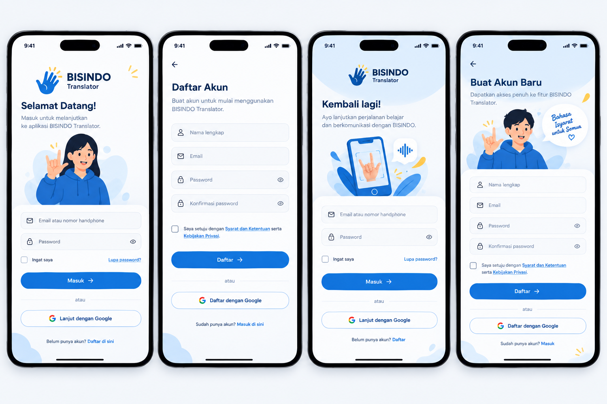

<div align="center">
  <h1>🤟 BISINDO Translator</h1>
  <p>Penerjemah Bahasa Isyarat Indonesia secara real-time di HP kamu.</p>

  
  
  
  
  
  
</div>

---

## Tentang Aplikasi

BISINDO Translator adalah aplikasi mobile yang bisa menerjemahkan gestur tangan BISINDO (Bahasa Isyarat Indonesia) jadi teks dan suara langsung lewat kamera HP — tanpa perlu koneksi internet untuk proses deteksinya.

Proyek ini dibuat dalam rangka PBL sebagai solusi nyata untuk membantu komunikasi komunitas tunarungu di Indonesia.

### Fitur

| | Fitur | Keterangan |
|---|---|---|
| 🎯 | **Real-time Scanner** | Arahkan kamera ke tangan, gestur langsung terdeteksi |
| 🔊 | **Text-to-Speech** | Hasil deteksi otomatis disuarakan |
| 📚 | **Kamus BISINDO** | Referensi gestur huruf A–Z dan kata sehari-hari |
| 🎓 | **Mode Belajar** | Latihan gestur dengan feedback benar/salah |
| 📋 | **Riwayat** | Lihat kembali hasil terjemahan sebelumnya |
| 👤 | **Akun** | Daftar, masuk, dan kelola profil |

---

## Preview

### Onboarding


### Login & Register



---

## Struktur Project

Repo ini berbentuk monorepo dengan dua bagian utama:

```
bisindo-translator/
├── mobile/                  # Flutter app
│   ├── lib/
│   │   ├── core/            # Tema, routing, DI, error handling
│   │   ├── features/        # Auth, Scanner, Kamus, Riwayat, Profil
│   │   └── shared/          # Widget dan service yang dipakai bersama
│   └── assets/              # Gambar, model TFLite, animasi, font
├── ml/                      # Python ML pipeline
│   ├── data/                # Dataset mentah dan hasil augmentasi
│   ├── notebooks/           # Jupyter untuk eksplorasi
│   ├── src/                 # Script dataset, training, evaluasi, export
│   └── models/              # Output .h5 dan .tflite
└── design/                  # File desain (mockup, color palette)
```

---

## Tech Stack

| Layer | Yang Dipakai |
|---|---|
| Mobile | Flutter 3.32 (Dart 3.8) |
| State Management | BLoC + Equatable |
| Navigasi | GoRouter |
| Dependency Injection | GetIt + Injectable |
| Auth | Firebase Authentication |
| Database | Cloud Firestore + Hive (lokal) |
| Storage | Firebase Storage |
| ML Training | Python + TensorFlow + MediaPipe |
| ML Inference | TFLite Flutter |
| Text-to-Speech | flutter_tts |

---

## Cara Menjalankan

### Yang Dibutuhkan

| Tool | Versi |
|---|---|
| Flutter | ≥ 3.32.x |
| Dart | ≥ 3.8.x |
| Python | ≥ 3.10 |
| Android Studio | Hedgehog ke atas |
| Git | — |

### 1. Clone

```bash
git clone https://github.com/hafisc/bisindo.git
cd bisindo
```

### 2. Setup Firebase

> ⚠️ Langkah ini wajib sebelum bisa menjalankan app.

1. Buka [Firebase Console](https://console.firebase.google.com/), buat project baru: **bisindo-translator**
2. Tambah Android app dengan package name: `com.bisindo.bisindo_translator`
3. Download `google-services.json`, lalu taruh di `mobile/android/app/`
4. Aktifkan **Authentication** — pilih Email/Password dan Google Sign-In
5. Aktifkan **Cloud Firestore** — mulai dengan mode test

### 3. Jalankan Flutter App

```bash
cd mobile/

flutter pub get

# Generate kode otomatis (DI, model, dll)
dart run build_runner build --delete-conflicting-outputs

flutter run
```

### 4. Setup ML (khusus Tim ML)

```bash
cd ml/

python -m venv .venv
.venv\Scripts\activate        # Windows
# source .venv/bin/activate   # Mac/Linux

pip install -r requirements.txt

jupyter notebook notebooks/
```

---

## Alur Aplikasi

```
Splash
  └─→ Onboarding (3 slide, muncul sekali)
        └─→ Login / Register
              └─→ Beranda
                    ├─→ Scan      (deteksi gestur real-time + suara)
                    ├─→ Kamus     (referensi gestur A-Z dan kata)
                    ├─→ Riwayat   (history hasil terjemahan)
                    └─→ Profil    (akun dan pengaturan)
```

---

## ML Pipeline

Model dilatih di Python lalu diekspor ke TFLite dan dipakai langsung di Flutter:

```
collect_data.py   →  Foto tangan per kelas (A-Z + kata)
augment.py        →  Augmentasi: flip, rotate, crop (100 jadi 500+ foto)
train.py          →  Training model CNN + MediaPipe landmarks
evaluate.py       →  Cek akurasi dan confusion matrix
export_tflite.py  →  Konversi ke .tflite
                  →  Copy ke mobile/assets/models/
```

Target awal: **26 huruf × 100 foto = 2.600 data**

---

## Pembagian Kerja

| Tim | Tanggung Jawab | Folder |
|---|---|---|
| Tim ML | Kumpul dataset, training, export model | `ml/` |
| Tim Mobile | Bangun UI, integrasi model, auth | `mobile/` |

---

## Command Cepat

```bash
# Flutter
flutter pub get                                           # install packages
dart run build_runner build --delete-conflicting-outputs  # generate code
flutter analyze                                           # cek error
flutter test                                              # jalankan test
flutter build apk --release                               # build APK

# Python ML
pip install -r requirements.txt
python src/dataset/collect_data.py
python src/training/train.py
python src/export/export_tflite.py
```

---

Dibuat untuk PBL — semoga bermanfaat buat komunitas tunarungu Indonesia. 🤟
